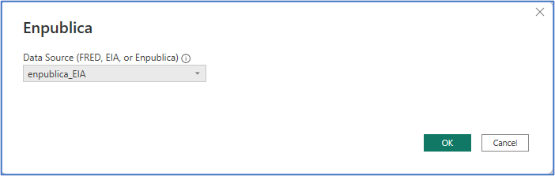
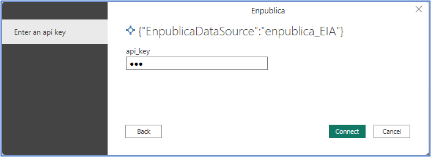
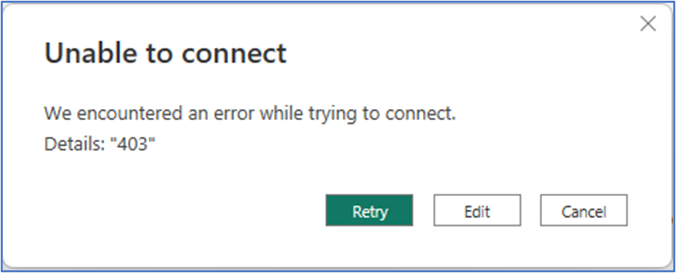
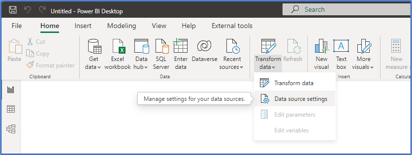
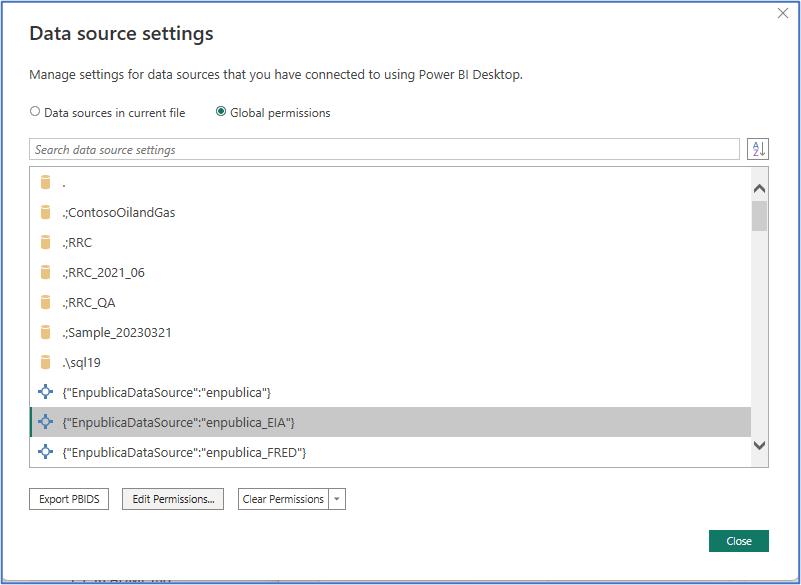

## Fixing Connection Errors for New Data Sources

In Power BI, you may be prompted to enter credentials when connecting to a new data source. If you enter incorrect credentials the first time, it can be a bit tricky to fix the problem. For example, let's use the Enpublica Data Connector for Power BI.

After clicking the OK button, we are prompted for an api\_key. In this example, we intentionally enter an invalid key.

We click Connect – and receive an error message.

If we click **Retry** , it attempts to reconnect using the _same credentials_. If we instead click **Edit** , it presents the initial Data connection window again.

We click **OK** , but we're back to the error window!

What do we do? Take a deep breath, cancel out of this dialog box and then, from the **Home** ribbon of the Power BI Desktop, click **Transform data – Data source settings.**

Find the corresponding Data Source – add click **Edit Permissions** to try again!

