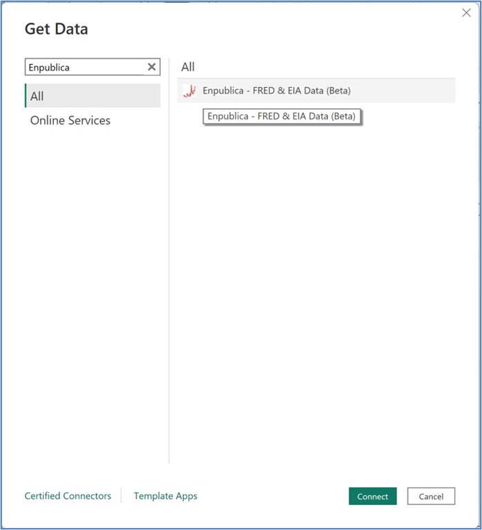
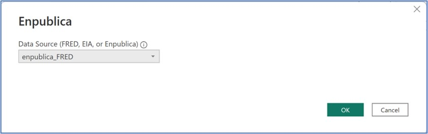

## Using the [Enpublica Data Connector](https://github.com/tylerchessman/PBI_FRED_EIA) for Power BI | Tutorial 1 | Part I

_A new data connector provides easy access to over 1 million economic and energy-related time series directly in Power BI_

### Summary

Have you ever wanted to perform your own economic analysis? Perhaps you read a recent article about employment or inflation – and wanted to dig into the numbers. Or you may be responsible for managing corporate data – but need to integrate commodity prices or macro-economic indicators. If so, you're in luck. A new data connector for Power BI makes it easy to tap into 1 million+ economic and energy-related time series and datasets. Let's learn how to use this new connector by analyzing three key indicators – economic growth, unemployment, and inflation.

### Introducing the Enpublica Data Connector

Inspired by an Excel add-in, the Enpublica Data Connector is essentially a wrapper around three different data sources –

- Louis Federal Reserve Economic Database ([FRED](https://fredhelp.stlouisfed.org/fred/about/about-fred/what-is-fred/)) – provides access to over 800,000 time series, collected from 100+ U.S. and international data sources
- S. Energy Information Administration ([EIA](https://www.eia.gov/opendata/documentation.php)) – maintains several hundred thousand time series and datasets related to domestic and internal energy production/usage
- Enpublica – a small set of supplemental datasets – including (older) historical data, unique energy and/or economic datasets not available in FRED/EIA, and a custom date dimension

Each of these sources provide an API (for those who work in oil & gas, API in this case means Application Programming Interface, not American Petroleum Institute) which can be used to import data into another tool. The Enpublica data connector makes using these APIs in Power BI easier; it automatically handles things like data type conversions, pagination for larger datasets, calling an API multiple times (without incurring usage time-outs), and securely storing API keys.

### Getting Started

In this tutorial, we will be using the Power BI Desktop – which can be downloaded from [here](https://powerbi.microsoft.com/en-us/desktop/). Note – If you are a MAC user, consider a virtualization technology like [Boot Camp](https://support.apple.com/en-us/HT201468#:~:text=How%20to%20install%20Windows%2010%20on%20Mac%201,the%20Boot%20Camp%20installer%20in%20Windows%20See%20More.) or [Parallels](https://www.parallels.com/). Then, head over to the Enpublica data connector [repository](https://github.com/tylerchessman/PBI_FRED_EIA) for installation instructions.  This first tutorial makes use of the FRED database, so this is the only api\_key you'll need.

While you can create a new report from scratch, we've created a starter report to save a bit of time with formatting and arranging visuals – it can downloaded [here](https://github.com/tylerchessman/PBI_FRED_EIA/raw/main/Tutorials/1_Part1/Enpublica_Tutorial1_Part1_Begin.pbix).

#### Connect to FRED

Open the Power BI Desktop, and then (from either the initial splash screen, or the Home ribbon) click **Get data**. In the **Get Data** dialog box, type Enpublica in the search box (or look for the connector in the Online Services section), and then click the **Connect** button. **Note** – while the Connector is in Beta, you will see a **Connecting to a third-party service** dialog box; click the **Continue** button.

The Enpublica data connector asks for an initial **Data Source (FRED, EIA, or Enpublica)**; choose **enpublica\_FRED** in the drop-down box and click the **OK** button.

You'll be asked to enter your [api\_key](https://fred.stlouisfed.org/docs/api/api_key.html); enter the key value and then click the **Connect** button. Tip - if you enter an incorrect api\_key, it can be a bit tricky to edit and correct; see this quick link on how to update credentials.

In the Navigator window, expand the FRED table; several child tables (ctgry, misc, releases, series, and sources) are listed. Click the arrow next to _ **series** _ **,** and then select/check _ **fn\_fred\_series** _ and _ **fn\_fred\_series\_observations** _. Next, click the _ **Transform Data** _ to open the Power Query Editor. If you accidently click the _ **Load** _ button, no worries; just click the _ **Transform data** _ button in the _ **Home** _ ribbon to open the Power Query Editor.

**Tip** : in the Power Query Editor, a function definition may sometimes appear to have an error (e.g., a question mark or triangle icon); this can be resolved by simply clicking the function name or (if necessary) selecting **Refresh Preview** from the Home ribbon.

Click **fn\_fred\_series** in the Queries window, enter the following values into the _ **series\_id** _ parameter: **GDPC1, UNRATE, CPIAUCNS**. Next, click the Invoke button; rename the Query to fred\_series.

Next click/highlight the **fn\_fred\_series\_observations** function, enter the following values into the series\_id parameter: **GDPC1, UNRATE, CPIAUCNS&units=pc1** , and then click the **Invoke** button. This will return the same three series, but instead of metadata about the series, the actual values (i.e. the observations) are returned. Rename the **Invoked Function** to **fred\_series\_obs**. In the **Home** ribbon of the Power Query Editor, click the **Close & Apply** button.

Note: The additional parameter value for the CPI series ( **&units=pc1** ) requests a data value transformation (in this case, the percent change from a year ago); learn more about the additional parameters that can be passed into this function at [St. Louis Fed Web Services: fred/series/observations (stlouisfed.org)](https://fred.stlouisfed.org/docs/api/fred/series_observations.html#units).

#### Design a Report

Back in the Power BI Desktop, navigate to the Model View tab. Create a relationship between **fred\_series** and **fred\_series\_obs** by dragging the **series\_id** column to the **id** column. If you mess up or need to modify the relationship, double click the relationship line to open the **Edit relationship** window.

Next, switch to the Report View; if you're using the starter report, the page already has a blank table, slicer, and line chart visual created for you. Highlight the slicer (in the upper right-hand corner), and then click (or drag/drop) the **id** column from the **fred\_series** table.

Next, highlight the table (upper left-hand side) and click (or drag/drop) the following columns from the **fred\_series** table:

**id, title, observation\_start, observation\_end, last\_updated, frequency, units, URL.**

Note that I've adjusted the formatting of some of the date columns (observation start/end) – and set the Data category for the URL column to Web URL. These adjustments can be made by clicking on the name of a particular column (in the Data tab) and then using the **Column tools** Ribbon (to display a URL icon, rather than the actual text, set the URL icon to On in the Table visual formatting area).

Almost done; highlight the line chart visual, and the check (or drag/drop) the **date** and **value** column from the **fred\_series\_obs** table.

Select a series in the Slicer, and you should see something like the following -

If you get stuck, or something doesn't look quite right, download the finished report from [here](https://github.com/tylerchessman/PBI_FRED_EIA/raw/main/Tutorials/1_Part1/Enpublica_Tutorial1_Part1_Finish.pbix) (you can also see a hosted version of the report from [here](https://app.powerbi.com/view?r=eyJrIjoiM2NlOWFiN2QtYTQ0NS00NWY4LTg3OWMtYmVjNjhhNzhjMDkxIiwidCI6IjRmY2YxMGM2LWVjODEtNDhkYy1iNzZjLTJjM2Q2MDAxN2M1YSIsImMiOjZ9&embedImagePlaceholder=true)).

### Summary

This concludes part 1 of this tutorial, but realize we've just skimmed the surface of what's possible. In [part 2](https://github.com/tylerchessman/PBI_FRED_EIA/tree/main/Tutorials/1_Part2), we'll learn how add [recession bars](https://fred.stlouisfed.org/series/GDPC1) to a line chart. Before leaving this tutorial, be sure to check out the appendix (below) to learn more about the FRED database.

### Appendix

#### An overview of the FRED database

The St. Louis Federal Reserve Economic Database ([FRED](https://fredhelp.stlouisfed.org/fred/about/about-fred/what-is-fred/)) provides access to over 800,000 time series – collected from 100+ U.S. and international data sources. Data can be viewed directly in the browser or downloaded via a set of APIs. A good way to find a particular series is to use the search bar. For example, let's say we want to analyze Gross Domestic Product (GDP) in the United States. A quick search on the FRED website ([https://fred.stlouisfed.org/searchresults?st=GDP](https://fred.stlouisfed.org/searchresults?st=GDP)) displays several possible results – as shown in figure 1.

Figure 1 – Search for GDP on the FRED website

**Real Gross Domestic Product** is what is often cited in news articles and financial analysis – as it accounts for inflation i.e. it is the "_inflation adjusted value of the goods and services produced by labor and property located in the United States_". By clicking on the link for Real Gross Domestic Product, a time series chart is displayed, as shown in figure 2. The series id (GDPC1) is also provided alongside the series title.

.

While it is possible to download the series from this webpage, the API is a better approach – as it allows the data to be imported directly into a tool like Power BI – without having to first download the data to a file. This also means data can be refreshed in Power BI – eliminating any "extra" download steps.

#### The FRED API

As stated in the [documentation](https://fred.stlouisfed.org/docs/api/fred/), the FRED API can be called from any technology that can "_parse XML or JSON, and communicate with our servers using HTTPS_". Broken into different "groups" of URLs, the API retrieves information about categories, releases, series, sources, and tags (figure 3).

Figure 3 – API Groups

Currently, the Enpublica Data Connector implements many (but not all) of these API calls – some of which we'll explore in a future tutorial. Note: if there is a particular API call that you need to use that isn't _directly_ exposed, we provide a generic function ( **fn\_fred\_other** ) that can be used to make the call and get the raw json results.

Last Saved: 5/12/2023 2:26:00 PM
