## Using the [Enpublica Data Connector](https://github.com/tylerchessman/PBI_FRED_EIA) for Power BI | Tutorial 1 | Part II (Recession Bars)

_A new data connector provides easy access to over 1 million economic and energy-related time series directly in Power BI_

### Summary

In [part 1](https://github.com/tylerchessman/PBI_FRED_EIA/tree/main/Tutorials/1_Part1) of this tutorial, we learned how to use the new Enpublica Data Connector for Power BI to retrieve data from the St. Louis Federal Reserve Economic Database ([FRED](https://fredhelp.stlouisfed.org/fred/about/about-fred/what-is-fred/)). Now, we'll enhance this report by adding recession bars to a visual.

### Getting Started

Download the starter report for this tutorial, **Enpublica\_Tutorial1\_Part2\_Begin.pbix** , from [here](https://github.com/tylerchessman/PBI_FRED_EIA/raw/main/Tutorials/1_Part2/Enpublica_Tutorial1_Part2_Begin.pbix) (note – before you can refresh data from FRED, you'll need to obtain an api key; see part 1 for details, or visit the FRED website to [request a key](https://fred.stlouisfed.org/docs/api/api_key.html)). Next, open the report in Power BI Desktop; the report should look like the following:

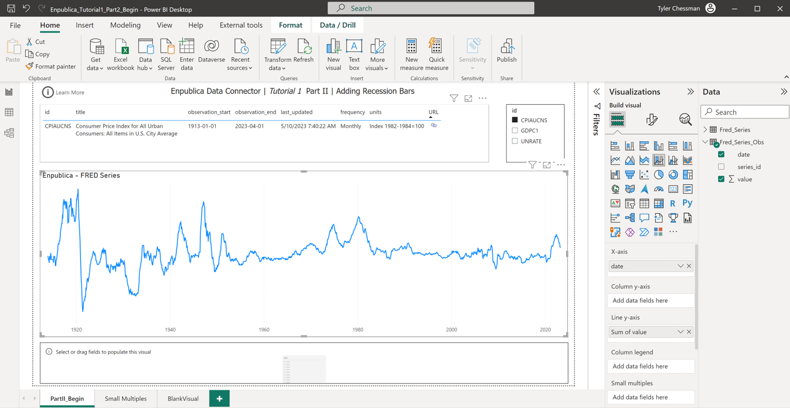

The chart (titled **Enpublica – FRED Series**) uses columns from the table **Fred\_Series\_Obs** , which stores observations for three series (CPIAUCNS, CDPC1, and UNRATE). There is a slicer on the page - with the series\_id set to CPIAUCNS (Consumer Price Index), along with a table showing summary information for the series. At the bottom of the page, there is a blank slicer (which we'll use later).

When viewing an economic time series on a line chart, it can be helpful to overlay information about business cycles; this is typically accomplished by adding vertical columns to the chart to denote recessionary periods. The official list of U.S. business cycles is maintained by the National Bureau of Economic Research (NBER). You can learn more about business cycle definitions (and see an example of a chart with the "recession bars") on their website - [https://www.nber.org/research/business-cycle-dating](https://www.nber.org/research/business-cycle-dating). Out-of-the-box line charts in Power BI don't have a built-in way of adding recession bars, but with a little bit of creativity (and the right data) it is possible to add these bars. Let's begin.

#### Add a date table

From the Home Ribbon, select Get data; in the Get Data dialog box) search for the **Enpublica** Data Connector, and then click the **Connect** button.

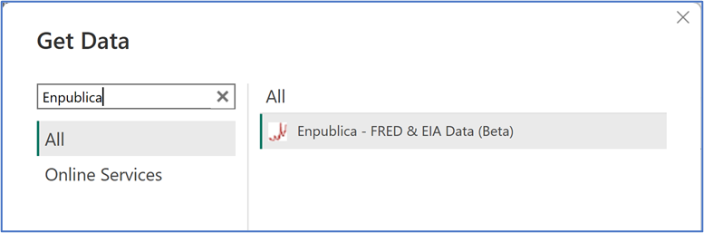

In the **Enpublica** Window, select enpublica from the Data Source drop down.

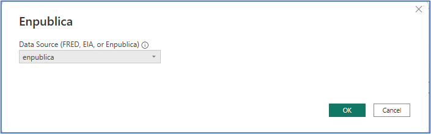

Note: the first time you use the enpublica data source, you will need to obtain an api\_key to establish connectivity. This api\_key is separate from the api\_key used to connect to the FRED database. You can submit a request for an enpublica api\_key via [email](mailto:api_key_request@enpublica.com?subject=New%20api_key%20request&body=I%20would%20like%20to%20request%20a%20new%20api_key%20for%20Enpublica%20datasets.). If you happen to enter in the wrong api\_key, please visit here to learn how to course correct.

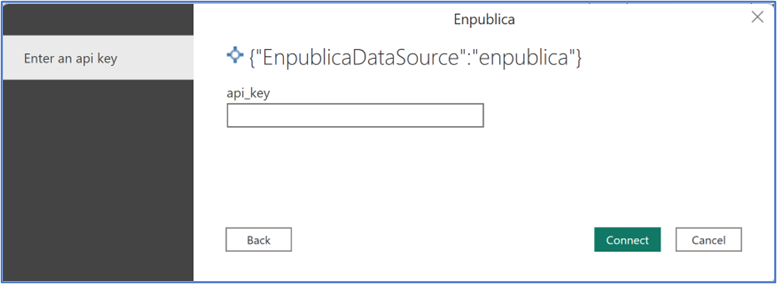

After entering in the api\_key value, in the Navigator, select the **fn\_enpublica\_date\_dim** and **fn\_enpublica\_v2\_series\_observations** functions, and then click the **Transform Data** button to open the Power Query Editor. If you accidentally click the **Load** (instead of **Transform Data** ) button, simply open the Power Query Editor by clicking the Transform Data from the Home Ribbon.

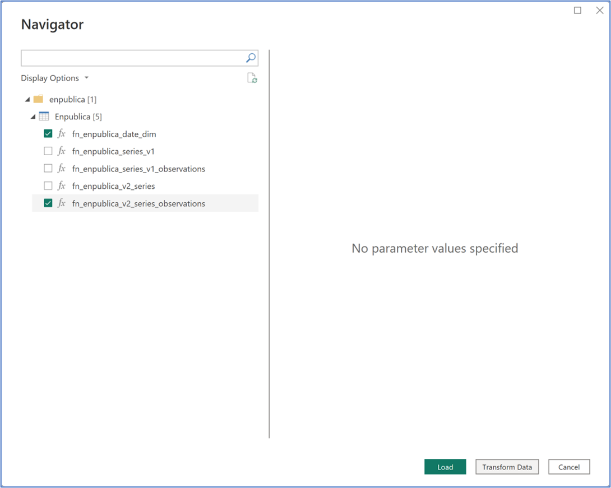

In the Power Query Editor, highlight **fn\_enpublica\_date\_dim** in the Queries list. **Tip** : a function definition may sometimes appear to have an error (e.g., a question mark or triangle icon, along with a message about "Preview refresh was cancelled…"); this can be resolved by simply clicking the function name or (if necessary) selecting **Refresh Preview** from the Home ribbon.

Enter **1/1/1900** in the start date parameter, and then click the **Invoke** button.

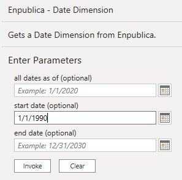

In the Queries list (or in the Query Settings) rename **Invoked Function** to **Date**. Next, highlight the **fn\_enpublica\_v2\_series\_observations** function; enter **USBusinessCycles** in the first text box, click the **Invoke** button.

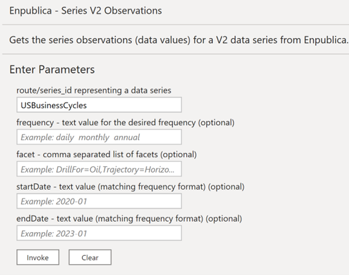

Rename this query to USBusinessCycles. Finally, click **Close & Apply** in the **Home** Ribbon to load data and close the Power Query Editor.

#### The Date Table

Back in the Power BI Window, navigate to the Data View, and select the **Date** table. Originally designed for performing analysis of U.S. government spending and debt, this function returns a date table – starting with dates as early as 1790 and extending up to 15 years in the future.

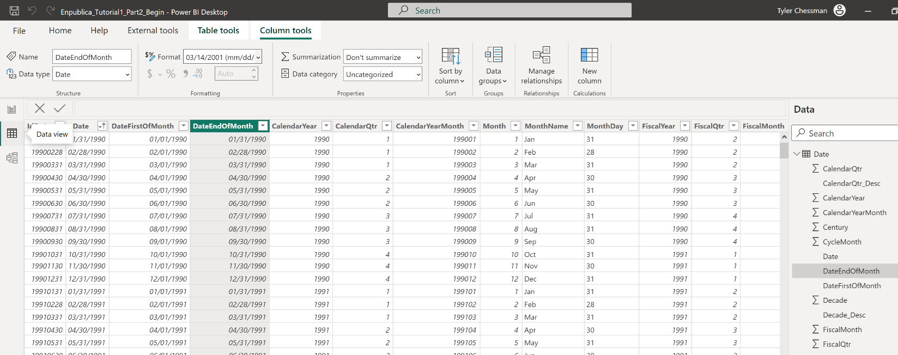

By default, only 1 row per month is returned, but all days for the month can be returned by entering a date value in the **all dates as of** parameter. Note that some of these columns may not be useful for your particular use case(s) (e.g., the fiscal columns are aligned to the U.S. government) – and they can be removed if desired. Also, you may want to adjust the display format of the Date columns.

For purposes of this article, the column of interest is **IsRecession**. Starting with the first recession in 1857, each row is marked with a Boolean (True) to indicate if the date corresponds to a recessionary period. Another column, IdCycle, is used to join to a reference table of the business cycles. We've imported this table – but note that it is optional for creating the recession bar visual affect.

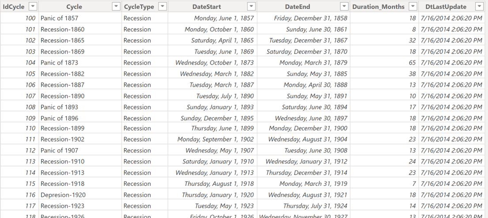

Let's create a relationship between the **Fred\_Series\_Obs** and **Date** table; switch to the Relationship view, and then drag/drop the **DateFirstOfMonth** column (from the **Date** table) onto the **date** column of the **Fred\_Series\_Obs** table (make sure you pick **DateFirstOfMonth** , and not the Date column – as FRED observations default to first of month; if you make a mistake, simply double click the relationship line to adjust the column selection). Also, if it wasn't done automatically, create a relationship between **USBusinessCycles** and **Date** by dragging/dropping the **IdCycle** column.

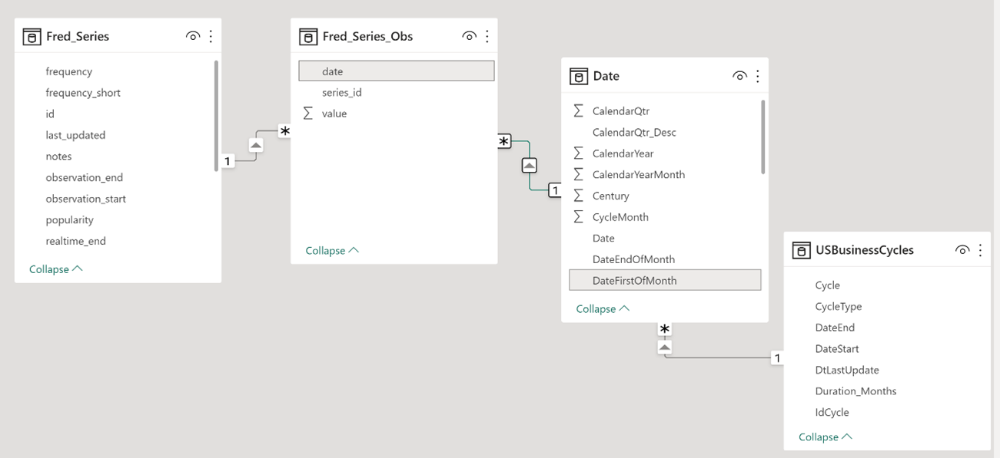

#### Add recession bars to the visual

Switching to the Report View, click/highlight the chart. Notice that the chart is a _Line and stacked column_ visual (see appendix for an explanation). Drag/drop the **IsRecession** column to the _Column y-axis_. At first, the visual appears broken.

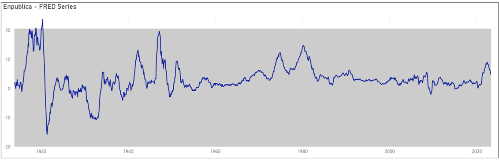

The "date" value used on the x-axis comes from the **Fred\_Series\_Obs** table instead of the **Date** table. To fix the visual, we swap **date** with the **Date** value from the Date Table.

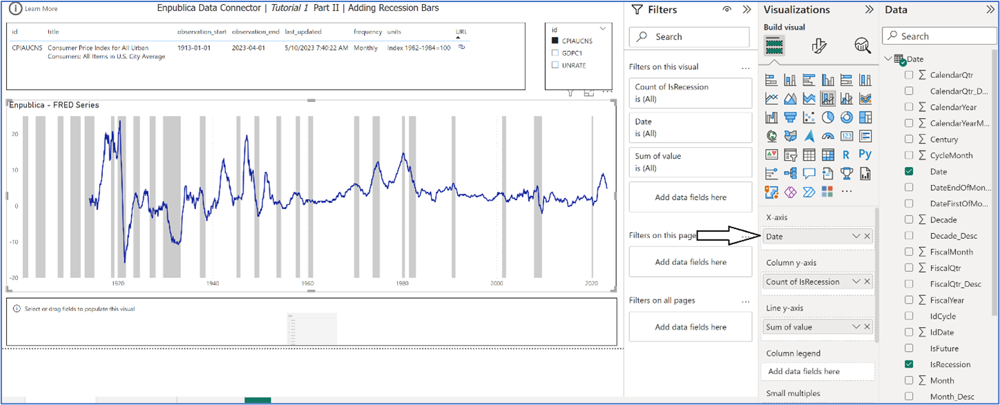

Alternatively, we can instead modify the relationship between the **Fred\_Series\_Obs** and **Date** Table – specifically, by setting the **Cross filter direction** to **Both**. Personally, I prefer using the first approach (and subsequently hiding the **date** value on the **Fred\_Series\_Obs** table to avoid confusion).

Next, highlight the empty Slicer (below the chart visual) and, after adding the **Date** column from the **Date** table, filter out dates prior to 1/1/1950.

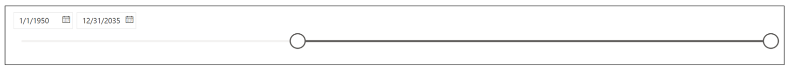

As a last touch, add a calculated column, **BusinessCycleName** , to the **Date** Table.

BusinessCycleName = RELATED(USBusinessCycles[Cycle])

Add this column to the Tooltips area of the visual. In my report, I've renamed the column in the Tooltips area to **Business Cycle** instead of **First BusinessCycleName**. I've also renamed Column y-axis column to **IsRecession** , and the Line y-axis to **Value**.

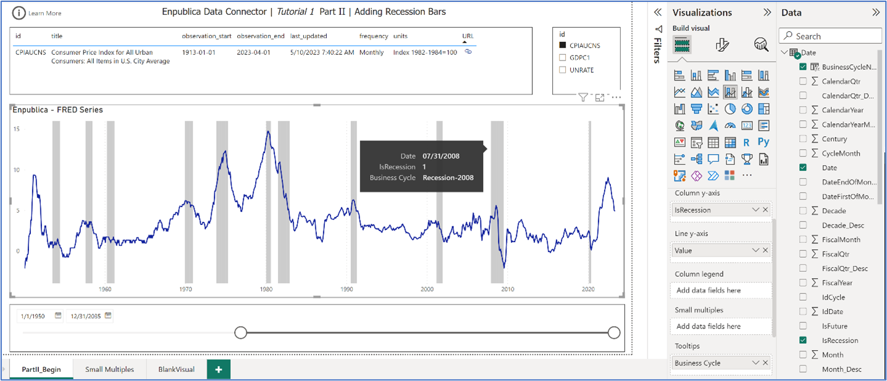

You're done! If you've run into any issues, no worries – I've posted a finished report [here](https://github.com/tylerchessman/PBI_FRED_EIA/raw/main/Tutorials/1_Part2/Enpublica_Tutorial1_Part2_Finish.pbix) (you can also see a [hosted version](https://app.powerbi.com/view?r=eyJrIjoiYjY3OGFhODQtZDM1YS00MDVjLThjMmMtZWRlYzg4YTU2OTBjIiwidCI6IjRmY2YxMGM2LWVjODEtNDhkYy1iNzZjLTJjM2Q2MDAxN2M1YSIsImMiOjZ9) of the report).  Be sure to check out the appendix, at the end of this article, for tips on how to format and reuse the chart. The final report also shows how to use small multiples to display multiple series at a time.

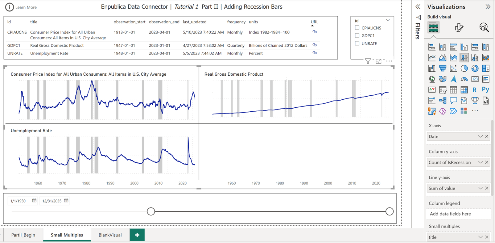

### Summary

In the [2nd](./../2) tutorial, we'll learn how to pivot data series observations (resulting in a format that is typically a bit easier to work with in Power BI) and adjust the series title.  Subsequent tutorials will highlight some of the other popular FRED API calls.

### Appendix

#### Creating a reusable Visual with Recession Bars

It takes a bit of finesse to get recession bars to display properly when working with the built-in Power BI visuals. To save time, the report page **BlankVisual** has a chart you can copy/paste into other pages (and other _reports_ – If you are working in the Power BI Desktop). For those interested in the details, here are the steps to get a good looking visual:

- If you're working with a Line chart, change it to a Line and stacked column chart
- Click/highlight the chart, and then head over to the **Format your visual** pane

- Turn the **Legend** to Off
- Set the Color of the Columns to **White, 20% darker**
- With the Y-axis toggled to **On** , expand the Values section, set the Switch axis position to **On**. Toggle the Title to On or Off as desired
- Toggle the Y-axis to **Off**.
