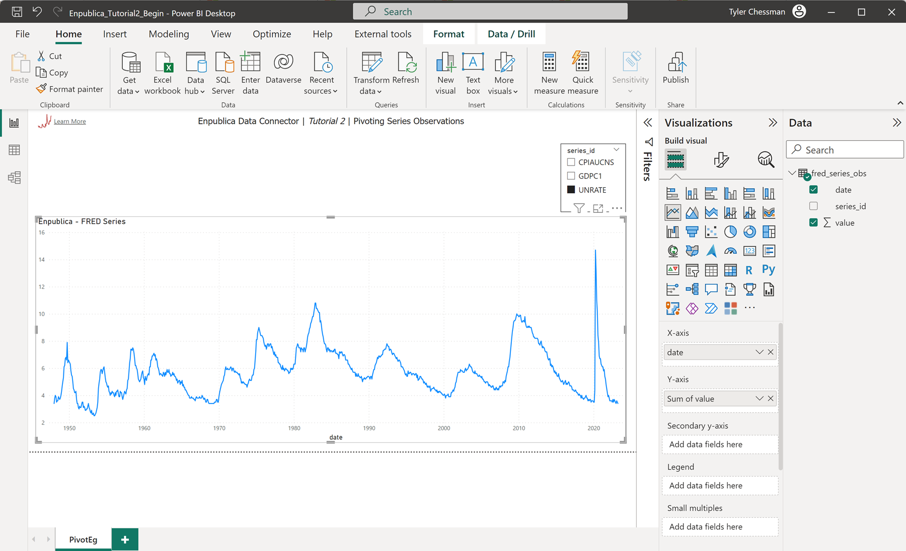
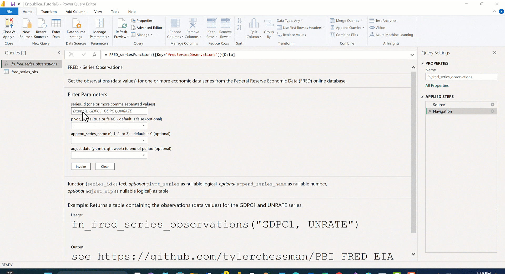
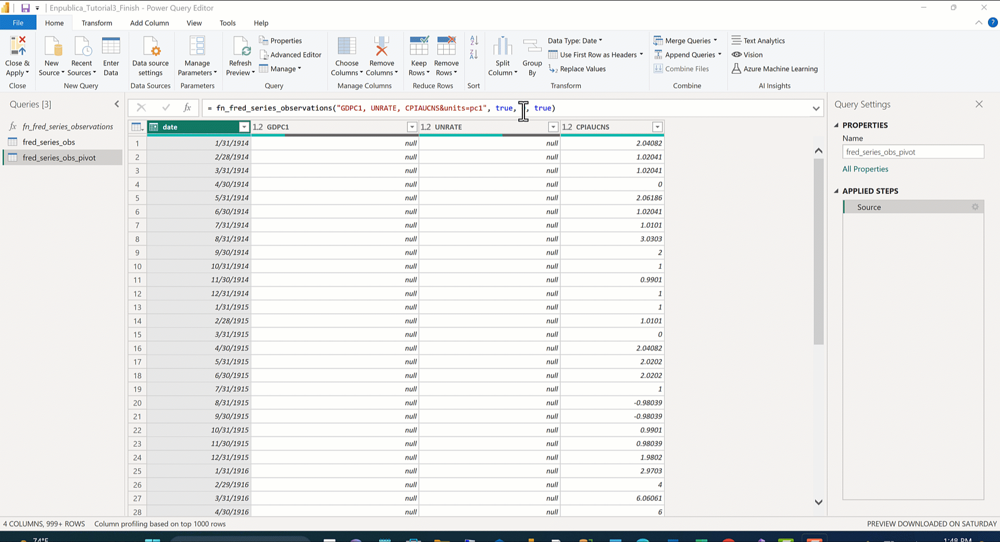
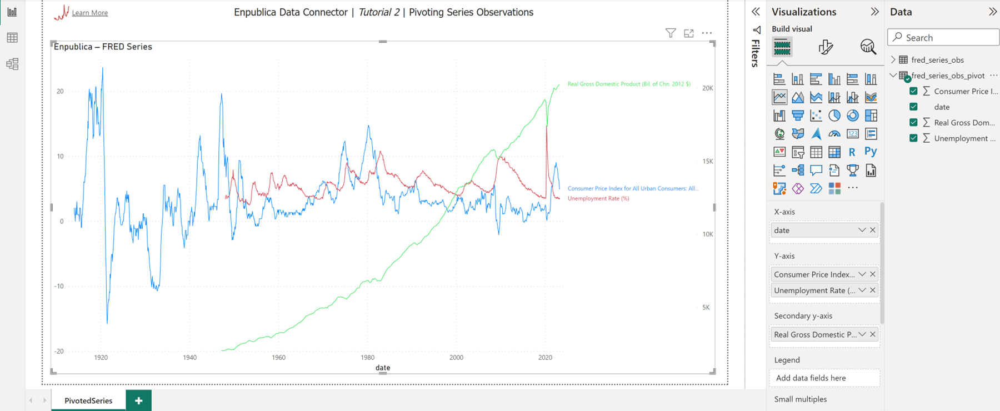

## Using the [Enpublica Data Connector](https://github.com/tylerchessman/PBI_FRED_EIA) for Power BI – Tutorial 2 (Pivoting and Formatting Series)

_A new data connector provides easy access to over 1 million economic and energy-related time series directly in Power BI_

### Summary

In this quick tutorial, we learn how to pivot and adjust data observations – resulting in a format that can be easier to work with in Power BI.

**Update** - The video companion for this tutorial is now available [here](https://youtu.be/SzQlwsSceW8).

### Getting Started

Download the starter report for this tutorial, [Enpublica_Tutorial2_Begin.pbix](https://github.com/tylerchessman/PBI_FRED_EIA/raw/main/Tutorials/2/Enpublica_Tutorial2_Begin.pbix) (note – this tutorial uses data from the FRED database, you'll need to obtain an api key to refresh the data; see Tutorial 1, part 1 for details, or visit the FRED website to [request a key](https://fred.stlouisfed.org/docs/api/api_key.html)). Next, open the report in Power BI Desktop:

The chart (titled **Enpublica – FRED Series**) uses columns from the table **fred\_series\_obs** , which stores observations for three series (CPIAUCNS, CDPC1, and UNRATE). There is a slicer on the page – to filter a particular series.

The **fred\_series\_obs** table contains multiple time series, and if you've ever worked with a historian like PI from OSISoft – this "date, id, value" format should be familiar. There are, however, some drawbacks to using this "single table" approach in a tool like Power BI. For example, we need to use filters (or create multiple measures) to isolate a single series\_id. The efficiency of this storage format is also less than ideal (as Power BI uses columnar storage). Let's look at an alternative means of storing these three series. From the **Home** ribbon, click **Transform Data** to open the Power Query Editor.

####

#### Modify the observations parameters

In the Query List, highlight the function **fn\_fred\_series\_observations** ; enter the following values for each parameter:

- series\_id: **GDPC1, UNRATE, CPIAUCNS&units=pc1**
- pivot\_series: **TRUE**
- append\_series\_name: **0**
- adjust\_date: **TRUE**

Click the **Invoke** button, and then rename the query to **fred\_series\_obs\_pivot.**

Now, each series\_id is a column – and can used/formatted independently of other series. Before wrapping up this quick tutorial, let's take a look at the other parameters; **append\_series\_name** (which can be used regardless of whether the data is pivoted) changes the series\_id value as follows:

0 – series\_id

1 – series title (taken from the fred\_series API)

2 – series id (series title)

3 – series title (units)

The parameter **adjust\_date**, when set to **true**, will set the date to the end of the period (week, month, quarter, or year) – as the FRED APIs default to the beginning of a given period.

Adjust the parameter values as follows: **fn_fred_series_observations("GDPC1, UNRATE, CPIAUCNS&units=pc1", true, 3, true)**; then, click the **Close & Apply** from the **Home** Ribbon. Back in the Power BI Desktop, try adjusting/creating a new visual with the pivoted series. I've posted a finished version of the report [here](https://github.com/tylerchessman/PBI_FRED_EIA/raw/main/Tutorials/2/Enpublica_Tutorial2_Finish.pbix) – and you can see an [online version](https://app.powerbi.com/view?r=eyJrIjoiMWE4ZGZiZDAtNDhlMi00OWZlLTgxYmItMDIxOGU1MmQ3N2U3IiwidCI6IjRmY2YxMGM2LWVjODEtNDhkYy1iNzZjLTJjM2Q2MDAxN2M1YSIsImMiOjZ9) as well.

### Summary

That's it for now. Next up, we'll take a look at a few of the other FRED API Calls, including the use of releases to simultaneously query/import multiple related series.
