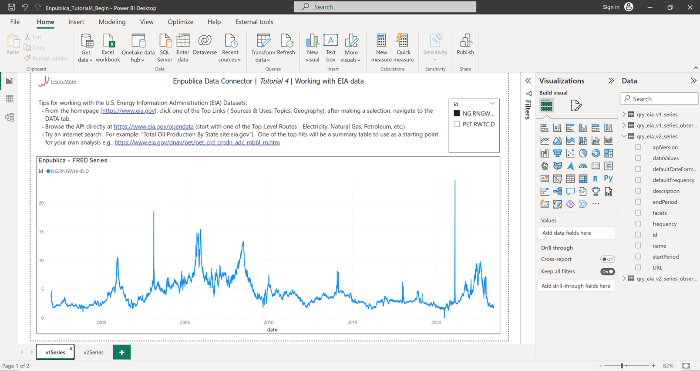

## Using the [Enpublica Data Connector](https://github.com/tylerchessman/PBI_FRED_EIA) for Power BI – Tutorial 4 (Accessing the EIA Datasets)

_A new data connector provides easy access to over 1 million economic and energy-related time series directly in Power BI_

### Summary

In the first several tutorials, we looked at how to connect to the FRED database – and briefly used Enpublica specific datasets for adding recession bars to visuals. In this post, we turn our attention to the other primary source of data, the U.S. Energy Information Administration (EIA).

### Getting Started

Download the report for this tutorial, **Enpublica\_Tutorial4.pbix** (note – this tutorial uses data from the EIA database, you'll need to obtain an api key to refresh the data; see Tutorial 1, part 1 for details, or visit the EIA website to [request a key](https://www.eia.gov/opendata/register.php)). Then, open the report in Power BI Desktop. Two pages have been created – each showing an example of how to visualize series data.

Next, open the Power Query Editor by clicking **Transform data** from the **Home** Ribbon. You'll notice four functions (and four queries) have already been added to this report:

**Tip** : to work with the connector in a _new_ report, you need to first add the functions -

- In the Power BI Desktop, click **Get data** from the **Home** ribbon; alternatively, in the Power Query Editor, click **New Source**
- Select the **Enpublica** Connector
- Select **enpublica\_EIA** as the initial Data Source
- Enter in your EIA api\_key value
- Select the desired function(s) from the Navigator window
- Select **Transform Data** (in the Power Query Editor, click **Connect** )

### Function Definitions

- **fn\_eia\_v1\_series** – returns metadata about one or more V1 series. A quick note about "V1" versus "V2"; similar to FRED, the EIA originally returned series in a pure time series format (i.e. date and value) – this is V1. The V1 API has been discontinued, but it is still possible to request a series using the original V1 series id.

- **fn\_eia\_v1\_series\_observations** – returns the observations (data values) for one or more V1 series. Like the FRED API, we've enhanced this function to allow for optional pivoting and customization of the series name.

- **fn\_eia\_v2\_series** – returns metadata about a V2 series.

- **fn\_eia\_v2\_series\_observations -** returns the observations (data values) for a V2 series. Unlike a V1 series, a V2 series is (potentially) a multi-dimensional, multi-value dataset – hence, only one V2 series can be requested/retrieved at a time. For example, the **electricity/retail-sales** V2 series return monthly data about electricity revenue, sales, price, and customer counts by U.S. state/region.

### Finding Data to Visualize

The EIA website is, like a lot of public data providers/aggregators, a bit challenging to navigate. With well over a million series available, finding the right data can take time, patience, and several iterations. Let me leave you with a few tips on how to begin. Close the Power Query Editor by the clicking the **Close & Apply** button from the **Home** ribbon. Back in the Power BI Desktop, select the page **v1Series**. At the top of the page, there are a few tips for getting started – including:

- Start from the beginning. From the homepage ([https://www.eia.gov](https://www.eia.gov/)), click one of the Top Links ( Sources & Uses, Topics, Geography); after making a selection, navigate to the DATA tab. Alternatively, try one of the Data Browsers (see the video post for an example).
- Browse the API directly at [https://www.eia.gov/opendata](https://www.eia.gov/opendata) (start with one of the Top-Level Routes - Electricity, Natural Gas, Petroleum, etc.)
- Try an internet search. Try the following search in a browser "Total Oil Production By State site:eia.gov"). One of the top hits will be a summary table to use as a starting point for your own analysis e.g., [https://www.eia.gov/dnav/pet/pet\_crd\_crpdn\_adc\_mbbl\_m.htm](https://www.eia.gov/dnav/pet/pet_crd_crpdn_adc_mbbl_m.htm).

### Summary

That's it for today. In a future post, we'll review a few comprehensive EIA datasets, including domestic and international energy product trends. Stay tuned!
