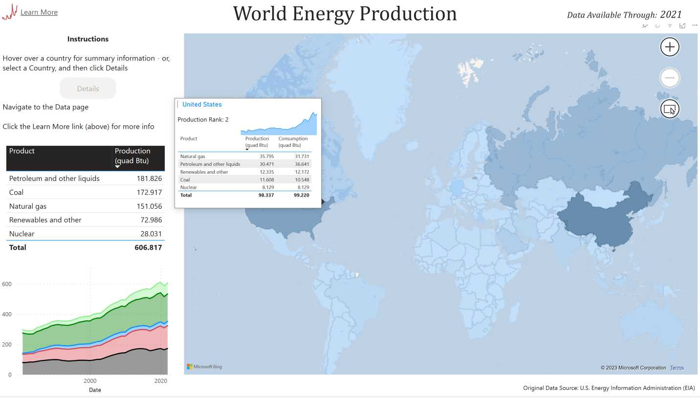
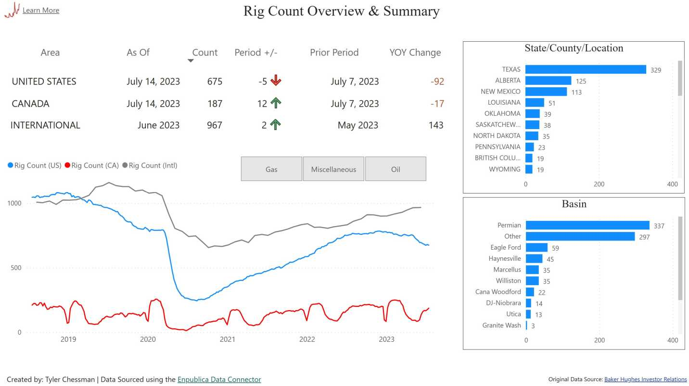

## The [Enpublica Data Connector](https://github.com/tylerchessman/PBI_FRED_EIA) for Power BI Gallery

_A new data connector provides easy access to over 1 million economic and energy-related time series directly in Power BI_

### Summary

As we create new and interesting reports, we plan to drop them here in the gallery.  Make sure to check back periodically for updates and new entries!

### Gallery Items

* **World Energy Production**.  Using data from the U.S. EIA, this report shows annual energy production and consumption (by country) since 1980.  The Enpublica Data Connector automatically handles the pagination needed to return the ~75k rows.  This report also uses bookmarks and a tooltip page to aid in visualization.   Download the report [here](https://github.com/tylerchessman/PBI_FRED_EIA/raw/main/Tutorials/Gallery/EIA_WorldEnergyProduction.pbix); a hosted version of the report is available [here](https://app.powerbi.com/view?r=eyJrIjoiMDZmYTQzZmUtNzgyZC00ZDM0LTk1ODQtMmM5NzIwZDkwZWI3IiwidCI6IjRmY2YxMGM2LWVjODEtNDhkYy1iNzZjLTJjM2Q2MDAxN2M1YSIsImMiOjZ9&embedImagePlaceholder=true).
  

* **Rig Counts**.  Sourced from Baker Hughes, this bellweather indicator for the Oil & Gas industry is closely watched by investors.  Download the report [here](https://github.com/tylerchessman/PBI_FRED_EIA/raw/main/Tutorials/Gallery/RigCountsV2.pbix); a hosted version of the report is available [here](https://app.powerbi.com/view?r=eyJrIjoiNGJhZGI2YjQtNWJiZC00NWNjLWIzN2EtOGZkY2FkMDk4M2EyIiwidCI6IjRmY2YxMGM2LWVjODEtNDhkYy1iNzZjLTJjM2Q2MDAxN2M1YSIsImMiOjZ9).

* **Stay tuned** for more!
